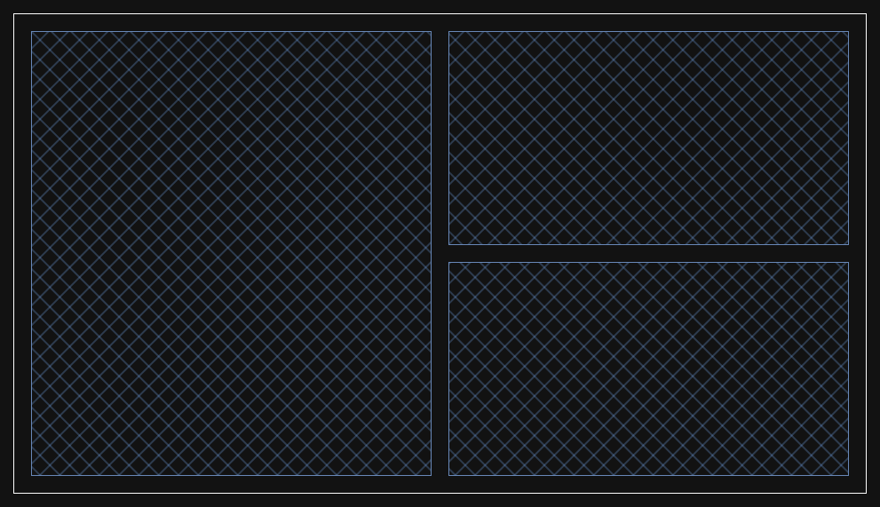

2025 Capstone Project<br>Tamara Slone<br>Joe Wigdor<br>

# SlideMark

A Markdown-based presentation tool.

## Introduction

SlideMark is a markdown-like parser and renderer for presentation slides. A dual-pane GUI editor allows the user to create a presentation slide deck using a version of markdown which includes functionality to demarcate slides and describe slide styling and layout. Initially this application will be offline and cross-platform, with the potential for a web app in the future. HTML and CSS will provide the backbone for slide styling. An assortment of slide layouts will be provided. A presentation mode will allow full-screen display of slides. Currently, this project is in pre-alpha with only source available.

## Purpose

This software aims to provide an alternative to traditional point-and-click presentation tools like Microsoft Powerpoint or LibreOffice Impress. The idea is to reduce a slide to its component parts via HTML/CSS templates, then fill those components in with text and images formatted with markdown. Ideally, a user would be able to prepare a slide deck by writing source in markdown rather than fiddling with handles and spinners in a UI. This also separates the slide's content from its style and layout, and any of those aspects can be freely changed out. Slide styling and layout will be provided with HTML/CSS so it is easy to develop new options. SlideMark might appeal to people in the tech industry who might already use markdown to create formatted documentation.

## Usage

 A user would interact with the markdown view much like they would with a normal markdown editor, with the addition of a few new tokens to format the slides and provide ease of use. A reference of the supported tokens and delimiters is provided below.

## Reference

### Headers

| Element | Description              | Markdown Syntax    |
| ------- | ------------------------ | ------------------ |
| H1      | Largest heading or title | `# Heading 1`      |
| H2      | Second largest heading   | `## Heading 2`     |
| H3      | Third largest heading    | `### Heading 3`    |
| H4      | Fourth largest heading   | `#### Heading 4`   |
| H5      | Fifth largest heading    | `##### Heading 5`  |
| H6      | Sixth largest heading    | `###### Heading 6` |

### Text Styles

| Element        | Description               | Syntax                   |
| -------------- | ------------------------- | ------------------------ |
| Bold           | Makes text bold.          | `**text**` or `__text__` |
| Italics        | Makes text italic.        | `*text*` or `_text_`     |
| Underline      | Underlines text.          | `++Underlined text++`    |
| Strike-through | Strikes through text.     | `~~strikethrough text~~` |
| Superscript    | Creates superscript text. | `;;Superscript;;`        |
| Subscript      | Creates subscript text.   | `,,Subscript,,`          |

### Containers

#### Single Line Code

| Syntax          | Output        |
| --------------- | ------------- |
| \`int x = 19;\` | `int x = 19;` |

#### Multiline Code

##### Syntax

\`\`\`<br>int y = 4;<br>int x = y + 7;<br>\`\`\`

##### Output

```
int y = 4;
int x = y + 7;
```

#### Blockquote

##### Syntax

\> "They told me I would go to the city."

##### Output

> "They told me I would go to the city."

### Embeds

#### Hyperlinks

Text enclosed in brackets defines the link text when viewed, and the url or path immediately after in parenthesis is the link's destination.

[Hyperlink Text] (http://www.url.com/)

#### Images

Similar to the previous, but preceded by an exclamation point. Alt text is shown while loading or for accessibility.

![Alt Text] (../images/picture.png)

#### Horizontal Rule

Three asterisks alone on a line like such `***` creates a horizontal rule, shown below.

***

### Lists

#### Ordered List

A list where the order of items matter. Invoked by leading a line with a number immediately followed by a period and a space. Sublists can be created by following the line with a tab, two tabs, etc.

##### Input

```
1. Item 1
	1. Item 1.1
2. Item 2
	1. Item 2.1
	2. Item 2.2
3. Item 3
	1. Item 3.1
		1. Item 3.1.1
		2. Item 3.1.2
	2. Item 3.2
```

##### Output

1. Item 1
	1. Item 1.1
2. Item 2
	1. Item 2.1
	2. Item 2.2
3. Item 3
	1. Item 3.1
		1. Item 3.1.1
		2. Item 3.1.2
	2. Item 3.2

#### Unordered List

A list where order doesn't matter. Invoked similar to ordered list, except instead of a number, we precede the list item with a dash `-` and a space.

##### Input

```
- Shapes
	- Circle
	- Square
	- Triangle
- Colors
	- Red
	- Green
		- Lime Green
		- Forest Green
	- Blue
```

##### Output

- Shapes
	- Circle
	- Square
	- Triangle
- Colors
	- Red
	- Green
		- Lime Green
		- Forest Green
	- Blue

### Comments

##### Input

`<!-- Comment here -->`

Similar to HTML, where we precede the comment with `<!--` and follow it with `-->`.

##### Output

<!-- Comment here -->

There may be no output here depending on your viewer.

### Tables

The headers of the columns are in the first line and will be bolded. They are separated by a single pipe symbol `|`, buffered by a space. The next line contains one dash between each separator. (Justify text coming later). The following rows of data are formatted the same as the headers, with a pipe buffered by a space.

##### Input

```
| Column 1 | Column 2 | Column 3 |
|-|-|-|
| Data 1   | Data 2   | Data 3   |
| Data 4   | Data 5   | Data 6   |
```

##### Output

| Column 1 | Column 2 | Column 3 |
| -------- | -------- | -------- |
| Data 1   | Data 2   | Data 3   |
| Data 4   | Data 5   | Data 6   |

### Slide Formatting

Slides are divided using a novel markdown token, `===`, or three equals signs in a row, followed by the name of an available layout. These layouts may differ from typical Powerpoint slide layouts because they lack a dedicated title section. Markdown allows us to title and subtitle slides the same way we would a document.

The following layouts are available:

- `single-left` - One content area in the middle of the slide, with its contents justified left. 

- `single-center` - One content area in the middle of the slide, with its contents justified center.

- `single-right` - One content area in the middle of the slide, with its contents justified right.


- `double-vertical` - Two content areas stacked vertically.


- `double-horizontal` - Two content areas side-by-side.


- `triple-vertical` - Three content areas stacked vertically.


- `triple-horizontal` - Three content areas side-by-side.


- `two-by-two`- Content areas divide the slide into four equal quadrants.


- `three-by-two` - Six equally sized content areas divide the slide into a grid.


- `two-by-three` - Six equally sized content areas divide the slide into a grid.


- `four-by-two` - Eight equally sized content areas divide the slide into a grid.


- `single-double-vertical` - The top half of the slide is one content area, and the bottom half is split, forming two content areas.


- `double-single-vertical` - The top half is split, forming two content areas, while the bottom half is one content area.


- `single-double-horizontal` - The left half of the slide is one content area, and the right half is split, forming two content areas.




- `double-single-horizontal` - The left half is split, forming two content areas, while the right half is one content area.


